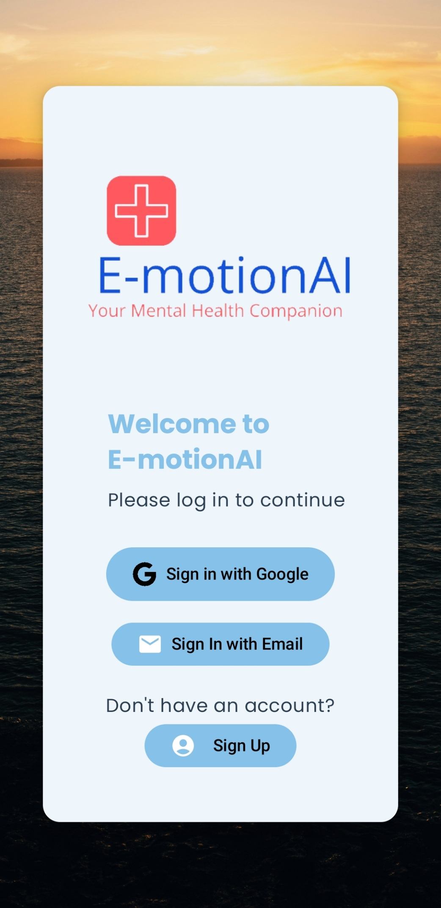
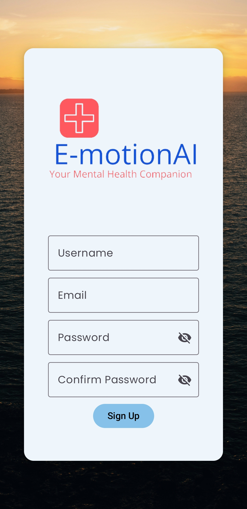
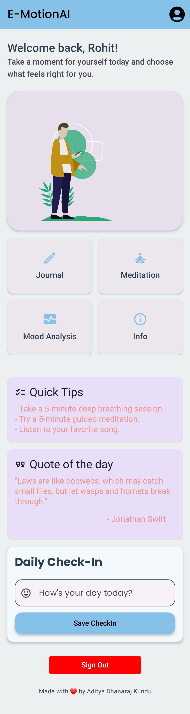
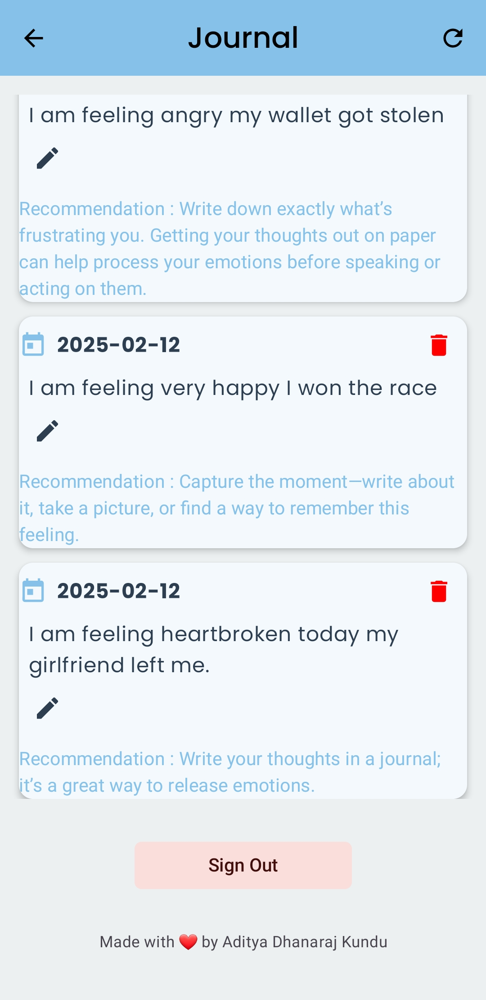
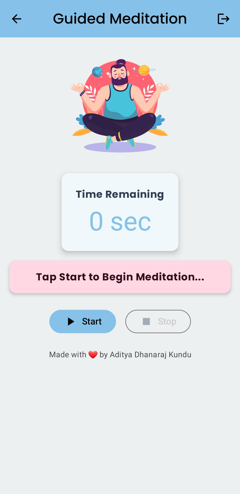
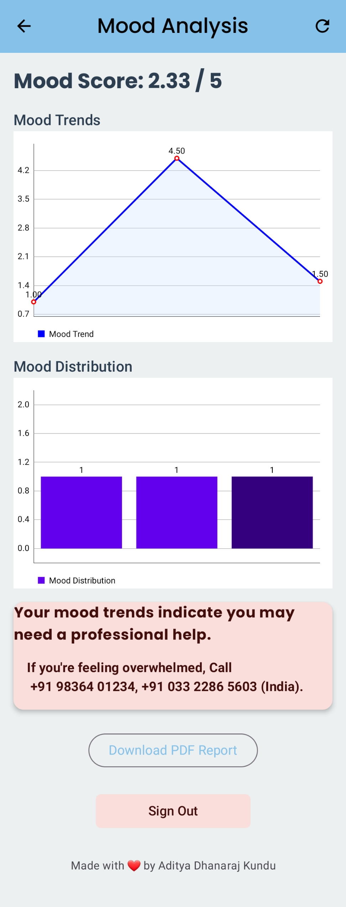

<hr>

# E-motionAI : An AI Based Mental Health Companion Android Application

A modern Android application built with Jetpack Compose, Material3, and MVVM architecture, integrating AI-driven mood analysis and sentiment tracking. This app features text-based emotion analysis, guided meditation, smart voice recommendations, and mood insights, with planned enhancements for voice journaling, AI-powered mood prediction, and a chatbot.

## 📌 Table of Contents
- [Overview](#-overview)
- [Features](#-features)
- [Tech Stack](#-tech-stack)
- [Installation & Setup](#-installation--setup)
- [Application Structure](#-application-structure)
- [API Integration](#-api-integration)
- [Screens & UI Design](#-screens--ui-design)
- [Future Enhancements](#-future-enhancements)
- [Contributing](#-contributing)
- [License](#-license)

## 📖 Overview
The Mental Health Companion AI is an Android application that allows users to log daily journal entries and receive AI-driven sentiment analysis. The app is designed to help users track mood trends, analyze emotions, and engage in guided meditation sessions.

### 💡 Upcoming Features:
- 🎤 Voice-based emotion analysis
- 📈 AI-powered mood prediction
- 🤖 Chatbot for mental health support

## 🌟 Features
### ✅ Current Features
- ✔ Journal Entry with AI Sentiment Analysis 📝
- ✔ Mood Trends Visualization 📊
- ✔ Smart Alerts For Alarming Low Mood Score ⚠️
- ✔ Guided Meditation 🧘
- ✔ Modern Material3 UI 🎨

### 🔄 Planned Enhancements
- 🔹 Voice Journaling with Sentiment Analysis 🎙️
- 🔹 AI-Powered Mood Prediction 📈
- 🔹 Chatbot for Mental Health Conversations 🤖

## 🛠 Tech Stack
### Android Development
- **Kotlin** – Primary programming language
- **Jetpack Compose** – Modern UI toolkit
- **Material3** – Latest UI components
- **Retrofit** - For internet connection in Android
- **MPAndroidChart** – Mood trend visualizations
- **RoomDB** - Local Database
- **Firebase** - Firebase Authentication
- **MVVM Architecture** – Ensures scalability

### Backend & AI
- **Flask API** – Sentiment analysis & AI processing
- **Transformers (DistilBERT)** – Emotion classification
- **Torch**
- **SkLearn**

## 📥 Installation & Setup
### 1️⃣ Clone the Repository
```bash
git clone https://github.com/your-repo/mental-health-companion-ai.git
cd mental-health-companion-ai
```

### 2️⃣ Open in Android Studio
- Open the `mental-health-companion-ai` project in Android Studio
- Sync Gradle and build the project

### 3️⃣ Setup Flask Backend (Optional)
If running the AI model locally, start the backend:
```bash
cd backend/
python app.py
```

### 4️⃣ Run the Android App
- Select an emulator or a physical device
- Click **Run ▶️**

<h1 align="center">📱 Screens & UI Design</h2>

<div style="display: flex; justify-content: space-between; align-items: flex-start; gap: 40px; margin: 20px 0;">
  <div style="flex: 1;">
    <h3>1️⃣ SignIn Screen</h3>
    <ul>
      <li>✔ Firebase Google Authentication</li>
      <li>✔ Firebase Email-Password Authentication</li>
    </ul>
  </div>
  
  <div style="flex: 1; text-align: right;">
    
  </div>
</div>

<div style="display: flex; justify-content: space-between; align-items: flex-start; gap: 40px; margin: 20px 0;">
  <div style="flex: 1;">
    <h3>2️⃣ SignUp Screen</h3>
    <ul>
      <li>✔ New Account Creation</li>
      <li>✔ Password Matching</li>
    </ul>
  </div>
  
  <div style="flex: 1; text-align: right;">
    
  </div>
</div>

<div style="display: flex; justify-content: space-between; align-items: flex-start; gap: 40px; margin: 20px 0;">
  <div style="flex: 1;">
    <h3>3️⃣ Home Screen</h3>
    <ul>
      <li>✔ Daily Check In</li>
      <li>✔ Smart Voice Recommendations</li>
      <li>✔ Motivational Quotes</li>
    </ul>
  </div>
  
  <div style="flex: 1; text-align: right;">
    
  </div>
</div>

<div style="display: flex; justify-content: space-between; align-items: flex-start; gap: 40px; margin: 20px 0;">
  <div style="flex: 1;">
    <h3>4️⃣ Journal Screen</h3>
    <ul>
      <li>✔ Previous Journals With Recommendation</li>
      <li>✔ Edit and Delete Previous Journals</li>
    </ul>
  </div>
  
  <div style="flex: 1; text-align: right;">
    
  </div>
</div>

<div style="display: flex; justify-content: space-between; align-items: flex-start; gap: 40px; margin: 20px 0;">
  <div style="flex: 1;">
    <h3>5️⃣ Meditation Screen</h3>
    <ul>
      <li>✔ Smart Guided Meditation Session Based on your mood</li>
      <li>✔ Ambient Sounds</li>
    </ul>
  </div>
  
  <div style="flex: 1; text-align: right;">
    
  </div>
</div>

<div style="display: flex; justify-content: space-between; align-items: flex-start; gap: 40px; margin: 20px 0;">
  <div style="flex: 1;">
    <h3>6️⃣ Mood Screen</h3>
    <ul>
      <li>✔ Charts with Mood Trends</li>
      <li>✔ PDF Report Generation</li>
    </ul>
  </div>
  
  <div style="flex: 1; text-align: right;">
    
  </div>
</div>

<div style="display: flex; justify-content: space-between; align-items: flex-start; gap: 40px; margin: 20px 0;">
  <div style="flex: 1;">
    <h3>7️⃣ Profile Screen</h3>
    <ul>
      <li>✔ Change Passwords</li>
      <li>✔ Edit Profile</li>
      <li>✔ Download PDF Report</li>
    </ul>
  </div>
  
  <div style="flex: 1; text-align: right;">
    
  </div>
</div>

## 🔮 Future Enhancements
### 🚀 Planned Features
#### 1️⃣ 🎙️ Voice Journaling
- Record voice entries
- Transcribe text using Google Speech-to-Text
- Perform tone-based sentiment analysis

#### 2️⃣ 📈 AI-Powered Mood Prediction
- Predict future mood trends based on journal history

#### 3️⃣ 🤖 AI Chatbot
- Implement mental health chatbot for conversations

## 👨‍💻 Contributing
1. Fork the repository
2. Create a new feature branch (`git checkout -b feature-name`)
3. Commit your changes (`git commit -m "Add new feature"`)
4. Push to GitHub and create a pull request
